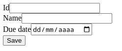
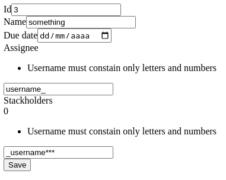
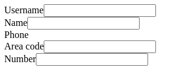

Symfony Forms
=============

> ℹ️  Esse repositório foi criado para acompanhar essa apresentação para um time interno

O pacote [`symfony/form`][symfony-form] é um componente do [Symfony][] para trabalhar com formulários HTML,
seja a geração de HTML ou a validação/processamento dos mesmos num servidor.

Nesse repositório vou explorar mais o uso desse componente para validação num servidor funcionando como
[BFF][] para um frontend que não necessariamente é provido pelo servidor processamento esses formulários.

Roteiro:
- Conceitos
- Exemplo básico
- Validação de entradas
- Formulários reutilizáveis
  - Resultado customizado
- Transformações
- Truques para BFF

Conceitos
---------

O Symfony Forms permite que montemos formulários HTML a partir de um objeto PHP, e com isso validarmos se o
mesmo foi enviado, se os dados enviados são válidos e completos, injetar os mesmos diretamente num objeto PHP
ou vetor, e se for usado junto ao pacote de [Twig][twig-bundle] permite gerar o HTML para o formulário da
definição citada.

Dessa forma um formulário do Symfony teria três etapas principais: construção, processamento e renderização.

A construção do formulário pode ser feita direto num Controller/Action ou a partir de [classes
`FormType`][formulario-reutilizavel]. Nas duas situações usamos o [`FormFactory`][form-factory] e precisamos
definir quais os campos que esperamos no formulário, assim como seus tipos e opcionalmente [como
validá-los][validacao-entradas] e [transformá-los][transformacoes].

Por padrão um formulário do Symfony também precisará de nome que será usado para diferenciar múltiplos
formulários numa mesma chamada, assim como controles como CSRF. Esse nome será usado como prefixo para todos
os campos do formulário, se definir a entrada `idade` e o nome do formulário for `pessoa`, então ele espera um
campo `pessoa[idade]` no corpo da requisição.

> 💡 Existem formas de contornar a necessidade do prefixo nas chamadas, visto que tê-lo não é interessantes
> pensando em uma API, como fazer isso será explorado em [Truques para BFF][truques-bff]

O processamento é feito chamando o método `handleRequest` de um formulário, o mesmo irá interpretar a
requisição e verificar se teve o envio do formulário, e feito isso podemos usar os métodos `isSubmitted` e
`isValid` para validar a requisição.

- Se tudo estiver certo no formulário o `isValid` irá retornar `true` e podemos chamar o `getData` do mesmo
  para pegar os dados tratados.
- Se o formulário não tiver sido enviado, o `isSubmitted` irá retornar  `false` e o `getData` não será
  confiável e nenhuma validacão será feita sobre os dados.
- Se o formulário foi enviado, mas houverem problemas com as informações, então o `isValid` irá retornar
  `false` e os erros estarão disponíveis no métodos `getErrors`

Exemplo básico
--------------

Para termos um exemplo, vamos criar um formulário para receber "tarefas", onde uma tarefa terá um nome
(`name`) e um previsão de entrega (`dueDate`), um Controller com esse formulário ficaria:

```php
class Controller
{
    public function __invoke(
        Request $request,
        FormFactoryInterface $formFactory,
        Environment $twig,
    ): Response {
        /** @var FormInterface */
        $form = $formFactory->createBuilder()
            ->add('name', TextType::class)
            ->add('dueDate', DateType::class, ['widget' => 'single_text'])
            ->add('save', SubmitType::class)
            ->getForm();

        $form->handleRequest($request);
        if ($form->isSubmitted() && $form->isValid()) {
            return new JsonResponse($form->getData());
        }

        return new Response($twig->render('form.html.twig', [
            'form' => $form->createView(),
        ]));
    }
}
```

No código acima estamos usando o `FormFactory` para montar o formulário, usamos o `handleRequest` para
processar a requisição, caso esteja válida estamos retornando os dados válidos como um JSON, se não estiverem,
ou não tiverem sido enviados, então mostramos o formulário em HTML.

O arquivo `form.html.twig` tem o seguinte conteúdo:
```twig

 {{ form(form) }} 
```

Se nada for informado o formulário abaixo:


Todos os tipos de `input` padrões do HTML5 são suportados, pode velos aqui:
https://symfony.com/doc/current/reference/forms/types.html

Outros tipos mais voltados para problemas e valores usados em aplicações também estão disponíveis, como
UuidType, BirthdayType e EnumType.

Validação de Entradas
---------------------

Até agora podemos definir os campos que existem no formulário e o tipo dos mesmos, mas se chamarmos o endpoint
apenas com o campo `form[name]` sem passar o `form[dueDate]`, ou o contrário, o Symfony intende que a
requisição é válida, e vai preencher o os outros campos com o valor padrão.

Para podermos de fato validar os valores enviados vamos adicionar o pacote [Validator](symfony-validator) do
Symfony (`symfony/validator`). Existe uma variedade de validadores disponíveis, para aplicá-los usaremos o
terceiro parâmetro do `FormType::add`, alterando o exemplo anterior para obrigar a passar os dois campos:

```php
use Symfony\Component\Validator\Constraints\NotBlank;
// ...
$form = $formFactory->createBuilder()
    ->add('name', TextType::class, ['constraints' => [
        new NotBlank(),
    ]])
    ->add('dueDate', DateType::class, ['widget' => 'single_text', 'constraints' => [
        new NotBlank(),
    ]])
    ->add('save', SubmitType::class)
    ->getForm();
// ...
```

Agora os dois campos passam a ser obrigatórios, se não passarmos o `$form->getErrors()` vai ser alimentado, e
se renderizarmos o formulário em HTML as mensagens irão aparecer como abaixo:


Podemos fazer outras validações mais interessantes como se o valor informado é um número de cartão de crédito
válido usando o [`Luhn`][val-luhn], ou se é um [`IP`][val-ip] válido.

Existem outras validações mais simples, se um valor está numa faixa, se tem alguns n itens, se é UUID, etc.
Que podem ser usadas para em combinações com tipos de entrada específicas para ter validações melhores.

Voltando para o exemplo original, vamos agora adicionar que o nome da tarefa precisa ter 5 caracteres ou mais,
e que a data prevista é opcional, mas que precisa ser hoje ou no futuro:

```php
use Symfony\Component\Validator\Constraints\GreaterThanOrEqual;
use Symfony\Component\Validator\Constraints\Length;
// ...
$form = $formFactory->createBuilder()
    ->add('name', TextType::class, ['constraints' => [
        new NotBlank(),
        new Length(min: 5),
    ]])
    ->add('dueDate', DateType::class, ['widget' => 'single_text', 'constraints' => [
        new GreaterThanOrEqual(new \DateTime('today'), message: 'Due Date can not be in the past'),
    ]])
    ->add('save', SubmitType::class)
    ->getForm();
// ...
```

Se tentarmos informar errado iremos receber:


Infelizmente as validações acima vão ser aplicadas apenas no processamento do formulário no backend, ou seja,
a versão renderizada do formulário não irá adicionar os atributos equivalentes para que o navegador trate,
para isso temos de adicioná-los "manualmente" usando a opção `attr` ao adicioná-los, para que o `name`
valide que tem mais de 5 caracteres ficaria:
```php
    ->add('name', TextType::class, [
        'attr' => ['minlength' => 5],
        'constraints' => [new NotBlank(), new Length(min: 5)],
    ])
```

Formulários reutilizáveis
-------------------------

Algo comum em quase todo sistema será que alguns endpoints terão entradas similares ou irão ter campos que tem
o mesmo proposito ou validação entre eles. Para tratar essas situações podemos mover a definição de um
formulário para uma classe dedicada que irá montar os formulários/adicionar validações e os Controllers e
outros formulários podem simplesmente referenciá-las.

Vamos dizer que queremos aproveitar a definição do formulário de tarefas que temos hoje, para isso vamos criar
uma nova classe que estende [`AbstractType`][abst-type], essa classe será como abaixo:

```php
<?php

namespace App\Controller\Reusing;

use Symfony\Component\Form\AbstractType;
use Symfony\Component\Form\Extension\Core\Type\DateType;
use Symfony\Component\Form\Extension\Core\Type\SubmitType;
use Symfony\Component\Form\Extension\Core\Type\TextType;
use Symfony\Component\Form\FormBuilderInterface;
use Symfony\Component\Validator\Constraints\GreaterThanOrEqual;
use Symfony\Component\Validator\Constraints\Length;
use Symfony\Component\Validator\Constraints\NotBlank;

class TaskType extends AbstractType
{
    public function buildForm(FormBuilderInterface $builder, array $options): void
    {
        $builder
            ->add('name', TextType::class, ['constraints' => [
                new NotBlank(),
                new Length(min: 5),
            ]])
            ->add('dueDate', DateType::class, [
                'widget' => 'single_text',
                'required' => false,
                'constraints' => [new GreaterThanOrEqual(
                    new \DateTime('today'),
                    message: 'Due Date can not be in the past'
                )],
            ])
            ->add('save', SubmitType::class);
    }
}
```

E agora podemos criar um `UpdateTaskType` que "estende" `TaskType`, mas pede o `ID` da tarefa para
atualizar. Esse novo `Type` fica assim:

```php
<?php

namespace App\Controller\Reusing;

use Symfony\Component\Form\AbstractType;
use Symfony\Component\Form\Extension\Core\Type\IntegerType;
use Symfony\Component\Form\FormBuilderInterface;
use Symfony\Component\Validator\Constraints\NotBlank;

class UpdateTaskType extends AbstractType
{
    public function buildForm(FormBuilderInterface $builder, array $options): void
    {
        $builder
            ->add('id', IntegerType::class, [
                'priority' => 1, // just to put it into the top
                'constraints' => [new NotBlank()],
            ]);
    }

    public function getParent(): string
    {
        return TaskType::class;
    }
}
```

No Controller vamos fazer uma alteração para usar o `UpdateTaskType` no lugar de montar no método, no final
tudo fica igual exceto a montagem:
```php
class Controller implements ControllerInterface
{
    public function __invoke(/** ... */): Response {
        /** @var FormInterface */
        $form = $formFactory->createNamedBuilder('form', UpdateTaskType::class)
            ->getForm();

        $form->handleRequest($request);
        if ($form->isSubmitted() && $form->isValid()) {
            return new JsonResponse($form->getData());
        }
        // ...
```

O `createNamedBuilder` funcional igual ao `createBuilder`, exceto que ele permite dar um nome para o
formulário no lugar de deixar o nome definido no `Type` ou o autogerado.

O resultado disso é como abaixo:



Vamos dizer que agora queremos poder vincular qual é o usuário responsável pela tarefa assim como quem são as
pessoas interessadas na tarefa. Esses dois são informados passando o nome de usuário, e vamos precisar validar
que é um usuário válido, a regra será que aceita apenas letras minusculas e números.

Para isso vamos criar um `Type` chamado `UsernameType` para fazer essa validação:
```php
<?php

namespace App\Controller\Reusing;

use Symfony\Component\Form\AbstractType;
use Symfony\Component\Form\Extension\Core\Type\TextType;
use Symfony\Component\OptionsResolver\OptionsResolver;
use Symfony\Component\Validator\Constraints\Length;
use Symfony\Component\Validator\Constraints\Regex;

class UsernameType extends AbstractType
{
    public function getParent(): string
    {
        return TextType::class;
    }

    public function configureOptions(OptionsResolver $resolver): void
    {
        $resolver->setDefault('constraints', [
            new Length(min: 5),
            new Regex(
                '/^[a-z0-9]+$/',
                message: 'Username must constain only letters and numbers'
            ),
        ]);
    }
}
```

Feito isso podemos adicionar no `TaskType` da seguinte forma:
```php
            ->add('assignee', UsernameType::class)
            ->add('stackholders', CollectionType::class, [
                'entry_type' => UsernameType::class,
                'allow_add' => true,
                'allow_delete' => true,
            ])
```

Agora se renderizamos esse formulário e tentar informar valores incorretos teremos a seguinte imagem:



Como nesse formulário tivemos um campo que se repete usamos o [`CollectionType`][coll-type] que é a forma como
o Symfony permite adicionar coleções de objetos, aqui estamos usando apenas um valor, mas poderia ser um
`FormType` mais complexo como uma versão do `TaskType`.

### Resultados customizados

Podendo montar formulários, criar tipos customizados e reutilizar esses formulários podemos explorar uma
funcionalidade muito importante do Symfony Forms, que é poder informar uma classe de dados (`data_class`) para
ele alimentar no lugar de retornar um vetor.

Para uma classe poder ser usada como `data_class` duas coisas são necessárias:
- a classe não pode ter argumentos obrigatórios no construtor
- todos as propriedades que forem alimentados pelo `FormType` precisam ser públicas, ou terem um "setter"
  público.

Quase qualquer classe consegue atender esses requisitos, mas a minha recomendação seria que sejam usados
[DTOs][dto] no lugar de entidades, primeiro porque esse tipo de objeto é pensando para isso, e evita que o
estado das entidades fique inválido, mesmo que temporariamente, enquanto o Symfony Forms está alimentando e
validando os campos.

Um DTO que poderia ser usado para o `UpdateTaskType` que temos agora seria assim:

```php
<?php

namespace App\Controller\DataClass;

class TaskDTO
{
    private int $id;
    private string $name;
    private ?\DateTime $dueDate = null;
    private string $assignee;
    /** @var string[] */
    private array $stackholders = [];

    public function setId(int $id): void
    {
        $this->id = $id;
    }

    public function setName(string $name): void
    {
        $this->name = $name;
    }

    public function setDueDate(?\DateTime $dueDate): void
    {
        $this->dueDate = $dueDate;
    }

    public function setAssignee(string $assignee): void
    {
        $this->assignee = $assignee;
    }

    /** @param string[] $stackholders */
    public function setStackholders(array $stackholders): void
    {
        $this->stackholders = $stackholders;
    }

    // getters
}
```

Para o Symfony Forms usar esse DTO basta adicionar o método `configureOptions` e configurar o campo
`data_class`, como abaixo:

```php
    public function configureOptions(OptionsResolver $resolver): void
    {
        $resolver->setDefault('data_class', TaskDTO::class);
    }
```

Por padrão o Symfony Forms vai tentar usar atribuir diretamente na propriedade ou método com o mesmo nome da
entrada na classe de dados, mas caso esteja migrando um formulário para usar o Symfony Forms, ou simplesmente
tiver algum padrão nos campos que não seja o mesmo usado para o `data_class` então pode informar qual a
propriedade correta usando a opção `property_path`.

Digamos que no formulário original tivéssemos um prefixo para indicar o tipo, mas a `TaskDTO` continua igual,
então o `Type` ficaria como abaixo:

```php
<?php

namespace App\Controller\DataClass;

// ...

class PropertyPathType extends AbstractType
{
    public function buildForm(FormBuilderInterface $builder, array $options): void
    {
        $builder
            ->add('int_id', IntegerType::class, [
                'property_path' => 'id',
                'constraints' => [new NotBlank()],
            ])
            ->add('str_name', TextType::class, [
                'property_path' => 'name',
                'constraints' => [
                    new NotBlank(),
                    new Length(min: 5),
                ],
            ])
            ->add('dat_due_date', DateType::class, [
                'property_path' => 'dueDate',
                'widget' => 'single_text',
                'required' => false,
                'constraints' => [new GreaterThanOrEqual(
                    new \DateTime('today'),
                    message: 'Due Date can not be in the past'
                )],
            ])
            ->add('str_assignee', UsernameType::class, ['property_path' => 'assignee'])
            ->add('arr_stackholders', CollectionType::class, [
                'property_path' => 'stackholders',
                'entry_type' => UsernameType::class,
                'allow_add' => true,
                'allow_delete' => true,
            ])
            ->add('save', SubmitType::class);
    }

    public function configureOptions(OptionsResolver $resolver): void
    {
        $resolver->setDefault('data_class', TaskDTO::class);
    }
}
```

Transformações
--------------

Agora que estamos trabalhando com tipos mais complexos, ou ao menos estamos usando DTOs que podem estar
esperando [`Value Objects`][value-object] então encontramos um problema que é: Como converter tipos primitivos
do formulário para classes mais especializadas?

Se o o `Value Object` que estamos falando for uma composição de tipos, então o que precisamos fazer é
simplesmente criar um `FormType` especifico para ele e similar ao fizemos no `UsernameType` indicar esse tipo
como a entrada.

Num exemplo prático vamos dizer que temos um formulário para cadastrar usuários, que é representado no DTO
abaixo:

```php
<?php

class Phone
{
    private int $areaCode;
    private int $number;
    // getters & setters
}

class UserDTO {
    private string $username;
    private string $name;
    private Phone $phone;
    // getters & setters
}
```

Para podemos receber um `UserDTO` direto do Forms, precisaremos de dois `FormTypes`, um para cada classe, e
ficariam como abaixo:

```php
<?php

class UserType extends AbstractType
{
    public function buildForm(FormBuilderInterface $builder, array $options): void
    {
        $builder
            ->add('username', UsernameType::class)
            ->add('name', TextType::class)
            ->add('phone', PhoneType::class);
    }

    public function configureOptions(OptionsResolver $resolver): void
    {
        $resolver->setDefault('data_class', UserDTO::class);
    }
}

class PhoneType extends AbstractType
{
    public function buildForm(FormBuilderInterface $builder, array $options): void
    {
        $builder
            ->add('areaCode', IntegerType::class)
            ->add('number', IntegerType::class);
    }

    public function configureOptions(OptionsResolver $resolver): void
    {
        $resolver->setDefault('data_class', Phone::class);
    }
}
```

Se renderizarmos esse formulários teremos o seguinte resultado:



Caso fosse um `Value Object` do "apenas" encapsula um valor para garantir que está válido, como por exemplo
`Money`, podemos criar um `FormType` que aceita uma entrada inteira e a converte para `Money` antes de passar
para o DTO. Para isso vamos adicionar um `ModelTransformer` no `FormType`, e ficará assim:

```php
<?php

use Symfony\Component\Form\CallbackTransformer;

class MoneyType extends AbstractType
{
    public function getParent(): string { return IntegerType::class; }

    public function buildForm(FormBuilderInterface $builder, array $options): void
    {
        $builder->addModelTransformer(new CallbackTransformer(
            transform: fn ($value) => $value instanceof Money ? $value->value : null,
            reverseTransform: fn ($value) => is_null($value) ? null : new Money($value),
        ));
    }
}
```

Truques para BFF
----------------

Por mais que o Symfony Forms parece uma boa opção para validação de entradas de APIs, é importante entender
que esse não era o propósito original dele, e por isso existem alguns comportamentos que não casam tão bem.

A principal é que ele espera receber as entradas via `form-data`, isso virá um problema se esperarmos um
`Content-type` diferente como `XML` ou `JSON`. Mas é uma limitação simples de resolver, tudo que precisamos
fazer é ler o conteúdo da requisição e alimentar ela na propriedade `request` da `Request`, como abaixo:

```php
    public function __invoke(Request $request): Response
    {
        $json = json_decode($request->getContent(), flags: JSON_THROW_ON_ERROR|JSON_OBJECT_AS_ARRAY);
        $request->request = new \Symfony\Component\HttpFoundation\ParameterBag($json);
        // ...
    }
```

Com a lógica acima o `handleRequest` vai conseguir validar o `JSON` enviado.

A segunda limitação é que o Symfony Forms espera que todo o formulário esteja abaixo de uma chave com o mesmo
nome do `FormType`, isso quer dizer que se o formulário que criamos no inicio com `name` e `dueDate` não
aceitaria um `form-data`: `name=new task&dueDate=2022-02-01`, o Symfony Forms espera que as chaves seja
`form[name]` e `form[dueDate]`.

Para contornar isso precisamos "pular uma etapa", e forçar o Form a aceitar que ouve o envio. Isso é feito
chamando o método `summit` no lugar do `handleRequest`, e já passar os dados enviados.

```php
/** @var FormInterface */
$form = $formFactory->createNamedBuilder('form', UserType::class)->getForm();
$form->submit($request->request->all());

if ($form->isValid()) {
    return Response(status: 400);
}
$data = $form->getData());
// ...
```

E o último problema é que não existe uma forma simples/padrão de converter os erros do formulário numa saída
de API. O que o pacote espera é que simplesmente renderizemos o HTML dele novamente. Isso faz com que extrair
os erros sejam um pouco inconivente, a classe abaixo representa uma forma de converter um formulário com erros
para um `JSON`.

```php
<?php

namespace App\Form;

use Symfony\Component\Form\FormError;
use Symfony\Component\Form\FormInterface;

class FlattenFormErrors implements \JsonSerializable
{
    public readonly string $message;
    public readonly array $validations;

    public function __construct(FormInterface $form, string $name = null)
    {
        list('errors' => $this->validations, 'message' => $this->message) = $this->extract(
            $form,
            $name ?? $form->getName()
        );
    }

    /** @return array{errors:array<string,string[]>,message:string} */
    private function extract(FormInterface $form, string $prefix = ''): array
    {
        $errors = array_map(fn ($error) => $error->getMessage(), array_filter(
            iterator_to_array($form->getErrors(deep: false)),
            fn ($error) => $error instanceof FormError,
        ));

        $message = 0 === strlen($prefix) ? implode(PHP_EOL, $errors) : implode(
            PHP_EOL . $form->getConfig()->getOption('label') ?: $form->getName() . ': ',
            $errors
        );

        if (0 !== count($errors)) {
            $errors = [$prefix ?: '.' => $errors];
        }

        foreach ($form->all() as $childForm) {
            if (! $childForm instanceof FormInterface) {
                continue;
            }

            list('message' => $childMessages, 'errors' => $childErrors) = $this->extract(
                $childForm,
                ($prefix ? $prefix . '.' : '') . $childForm->getName()
            );

            if (0 === count($childErrors)) {
                continue;
            }

            $message .= PHP_EOL . $childMessages;
            $errors += $childErrors;
        }

        return compact('message', 'errors');
    }

    /**
     * {@inheritDoc}
     */
    public function jsonSerialize(): mixed
    {
        return ['message' => $this->message, 'validations' => $this->validations];
    }
}
```

[val-host]: https://symfony.com/doc/current/reference/constraints/Hostname.html
[val-luhn]: https://symfony.com/doc/current/reference/constraints/Luhn.html
[val-ip]: https://symfony.com/doc/current/reference/constraints/Ip.html
[symfony-form]: https://symfony.com/doc/current/forms.html
[Symfony]: https://symfony.com/
[BFF]: https://samnewman.io/patterns/architectural/bff/
[form-factory]: https://github.com/symfony/form/blob/0a1a3ea071a216e2902cebe0b47750ca51f12f27/FormFactory.php#L17
[abst-type]: https://github.com/symfony/symfony/blob/8084eb83a44a3639a95f0860456d737b7f2751dd/src/Symfony/Component/Form/AbstractType.php#L21
[formulario-reutilizavel]: #formulários-reutilizáveis
[truques-bff]: #
[twig-bundle]: https://symfony.com/components/Twig%20Bundle
[validacao-entradas]: #validação-de-entradas
[transformacoes]: #
[symfony-validator]: https://symfony.com/doc/current/validation.html
[coll-type]: https://symfony.com/doc/current/reference/forms/types/collection.html
[value-object]: https://martinfowler.com/bliki/ValueObject.html

<!-- vim: textwidth=110 colorcolumn=111
