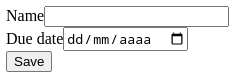
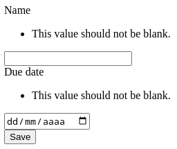
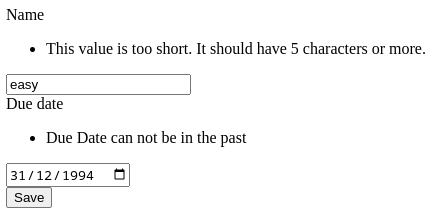

Symfony Forms
=============

> ℹ️  Esse repositório foi criado para acompanhar essa apresentação para um time interno

O pacote [`symfony/form`][symfony-form] é um componente do [Symfony][] para trabalhar com formulários HTML,
seja a geração de HTML ou a validação/processamento dos mesmos num servidor.

Nesse repositório vou explorar mais o uso desse componente para validação num servidor funcionando como
[BFF][] para um frontend que não necessariamente é provido pelo servidor processamento esses formulários.

Roteiro:
- Conceitos
- Exemplo básico
- Validação de entradas
- Formulários reutilizáveis
- Resultado customizado
- Passando parâmetros para tipos
- Transformações
- Truques para BFF

Conceitos
---------

O Symfony Forms permite que montemos formulários HTML a partir de um objeto PHP, e com isso validarmos se o
mesmo foi enviado, se os dados enviados são válidos e completos, injetar os mesmos diretamente num objeto PHP
ou vetor, e se for usado junto ao pacote de [Twig][twig-bundle] permite gerar o HTML para o formulário da
definição citada.

Dessa forma um formulário do Symfony teria três etapas principais: construção, processamento e renderização.

A construção do formulário pode ser feita direto num Controller/Action ou a partir de [classes
`FormType`][formulario-reutilizavel]. Nas duas situações usamos o [`FormFactory`][form-factory] e precisamos
definir quais os campos que esperamos no formulário, assim como seus tipos e opcionalmente [como
validá-los][validacao-entradas] e [transformá-los][transformacoes].

Por padrão um formulário do Symfony também precisará de nome que será usado para diferenciar múltiplos
formulários numa mesma chamada, assim como controles como CSRF. Esse nome será usado como prefixo para todos
os campos do formulário, se definir a entrada `idade` e o nome do formulário for `pessoa`, então ele espera um
campo `pessoa[idade]` no corpo da requisição.

> 💡 Existem formas de contornar a necessidade do prefixo nas chamadas, visto que tê-lo não é interessantes
> pensando em uma API, como fazer isso será explorado em [Truques para BFF][truques-bff]

O processamento é feito chamando o método `handleRequest` de um formulário, o mesmo irá interpretar a
requisição e verificar se teve o envio do formulário, e feito isso podemos usar os métodos `isSubmitted` e
`isValid` para validar a requisição.

- Se tudo estiver certo no formulário o `isValid` irá retornar `true` e podemos chamar o `getData` do mesmo
  para pegar os dados tratados.
- Se o formulário não tiver sido enviado, o `isSubmitted` irá retornar  `false` e o `getData` não será
  confiável e nenhuma validacão será feita sobre os dados.
- Se o formulário foi enviado, mas houverem problemas com as informações, então o `isValid` irá retornar
  `false` e os erros estarão disponíveis no métodos `getErrors`

Exemplo básico
--------------

Para termos um exemplo, vamos criar um formulário para receber "tarefas", onde uma tarefa terá um nome
(`name`) e um previsão de entrega (`dueDate`), um Controller com esse formulário ficaria:

```php
class Controller
{
    public function __invoke(
        Request $request,
        FormFactoryInterface $formFactory,
        Environment $twig,
    ): Response {
        /** @var FormInterface */
        $form = $formFactory->createBuilder()
            ->add('name', TextType::class)
            ->add('dueDate', DateType::class, ['widget' => 'single_text'])
            ->add('save', SubmitType::class)
            ->getForm();

        $form->handleRequest($request);
        if ($form->isSubmitted() && $form->isValid()) {
            return new JsonResponse($form->getData());
        }

        return new Response($twig->render('form.html.twig', [
            'form' => $form->createView(),
        ]));
    }
}
```

No código acima estamos usando o `FormFactory` para montar o formulário, usamos o `handleRequest` para
processar a requisição, caso esteja válida estamos retornando os dados válidos como um JSON, se não estiverem,
ou não tiverem sido enviados, então mostramos o formulário em HTML.

O arquivo `form.html.twig` tem o seguinte conteúdo:
```twig

 {{ form(form) }} 
```

Se nada for informado o formulário abaixo:



Todos os tipos de `input` padrões do HTML5 são suportados, pode velos aqui:
https://symfony.com/doc/current/reference/forms/types.html

Outros tipos mais voltados para problemas e valores usados em aplicações também estão disponíveis, como
UuidType, BirthdayType e EnumType.

Validação de Entradas
---------------------

Até agora podemos definir os campos que existem no formulário e o tipo dos mesmos, mas se chamarmos o endpoint
apenas com o campo `form[name]` sem passar o `form[dueDate]`, ou o contrário, o Symfony intende que a
requisição é válida, e vai preencher o os outros campos com o valor padrão.

Para podermos de fato validar os valores enviados vamos adicionar o pacote [Validator](symfony-validator) do
Symfony (`symfony/validator`). Existe uma variedade de validadores disponíveis, para aplicá-los usaremos o
terceiro parâmetro do `FormType::add`, alterando o exemplo anterior para obrigar a passar os dois campos:

```php
use Symfony\Component\Validator\Constraints\NotBlank;
// ...
$form = $formFactory->createBuilder()
    ->add('name', TextType::class, ['constraints' => [
        new NotBlank(),
    ]])
    ->add('dueDate', DateType::class, ['widget' => 'single_text', 'constraints' => [
        new NotBlank(),
    ]])
    ->add('save', SubmitType::class)
    ->getForm();
// ...
```

Agora os dois campos passam a ser obrigatórios, se não passarmos o `$form->getErrors()` vai ser alimentado, e
se renderizarmos o formulário em HTML as mensagens irão aparecer como abaixo:



Podemos fazer outras validações mais interessantes como se o valor informado é um número de cartão de crédito
válido usando o [`Luhn`][val-luhn], ou se é um [`IP`][val-ip] válido.

Existem outras validações mais simples, se um valor está numa faixa, se tem alguns n itens, se é UUID, etc.
Que podem ser usadas para em combinações com tipos de entrada específicas para ter validações melhores.

Voltando para o exemplo original, vamos agora adicionar que o nome da tarefa precisa ter 5 caracteres ou mais,
e que a data prevista é opcional, mas que precisa ser hoje ou no futuro:

```php
use Symfony\Component\Validator\Constraints\GreaterThanOrEqual;
use Symfony\Component\Validator\Constraints\Length;
// ...
$form = $formFactory->createBuilder()
    ->add('name', TextType::class, ['constraints' => [
        new NotBlank(),
        new Length(min: 5),
    ]])
    ->add('dueDate', DateType::class, ['widget' => 'single_text', 'constraints' => [
        new GreaterThanOrEqual(new \DateTime('today'), message: 'Due Date can not be in the past'),
    ]])
    ->add('save', SubmitType::class)
    ->getForm();
// ...
```

Se tentarmos informar errado iremos receber:



Infelizmente as validações acima vão ser aplicadas apenas no processamento do formulário no backend, ou seja,
a versão renderizada do formulário não irá adicionar os atributos equivalentes para que o navegador trate,
para isso temos de adicioná-los "manualmente" usando a opção `attr` ao adicioná-los, para que o `name`
valide que tem mais de 5 caracteres ficaria:
```php
    ->add('name', TextType::class, [
        'attr' => ['minlength' => 5],
        'constraints' => [new NotBlank(), new Length(min: 5)],
    ])
```

Formulários reutilizáveis
-------------------------


[val-host]: https://symfony.com/doc/current/reference/constraints/Hostname.html
[val-luhn]: https://symfony.com/doc/current/reference/constraints/Luhn.html
[val-ip]: https://symfony.com/doc/current/reference/constraints/Ip.html
[symfony-form]: https://symfony.com/doc/current/forms.html
[Symfony]: https://symfony.com/
[BFF]: https://samnewman.io/patterns/architectural/bff/
[form-factory]: https://github.com/symfony/form/blob/0a1a3ea071a216e2902cebe0b47750ca51f12f27/FormFactory.php#L17
[formulario-reutilizavel]: #formulários-reutilizáveis
[truques-bff]: #
[twig-bundle]: https://symfony.com/components/Twig%20Bundle
[validacao-entradas]: #validação-de-entradas
[transformacoes]: #
[symfony-validator]: https://symfony.com/doc/current/validation.html

<!-- vim: textwidth=110 colorcolumn=111
